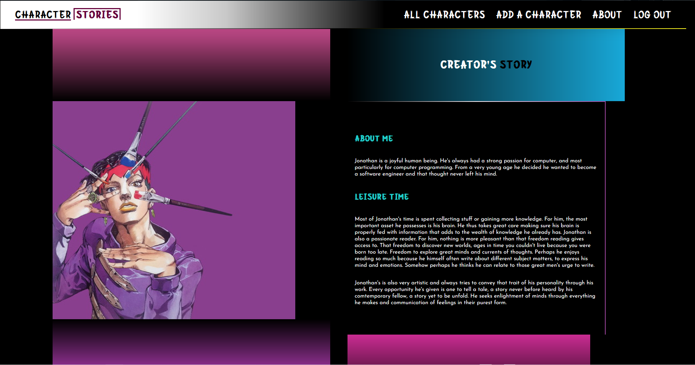

# PC Character Stories

***

PC Character Stories is an app that was born from the love of pop culture. In facts, pop culture has experienced phenomenal growth in just a few years and has taken a special place in each of our lives. This application is intended to be a reminder of the tender moments of childhood spent watching television shows or just talking with friends about what happened in the last episode of dragon ball(for those of you who know). It is the author hope that everyone finds in it something they can appreciate and that brings the nostalgy of lost memories.

## Getting Started

***

# [Engage online at this link]()

Recandle those lost moments of your childhood or laugh about those you are living now. You get to pick your favourite pop culture characters, add them to a database and link them to their stories as you remember them. Join other people in celebrating the positive impact pop culture has on your life.

## Attributions

***

> ### Fonts:
 - [Google fonts](https://fonts.google.com/)
 - [Font space](https://www.fontspace.com/)
 - [1001 Fonts](https://www.1001fonts.com/)
 - [1001 Free Fonts](https://www.1001freefonts.com/)

> ### Images and Layout:
 - The images were downloaded from:
 - [Wallpaper Abyss](https://wall.alphacoders.com/)
 - [Wallpaper Flare](https://www.wallpaperflare.com/)

## Technologies Used

***

- Python
- Django
- HTML
- CSS
- JavaScript
- SQL
- neondb
- FlyIo

## Icebox - Next Steps

***

- [x] Functionality to add a character
- [x] Functionality to add description to a character
- [x] Functionality to edit a character
- [ ] Functionality to add a character story
- [ ] Functionality to associate a character with that character story if present in the database
- [x] Functionality to signup
- [x] Functionality to login

## Author

***

Jonathan Takam | [LinkedIn](www.linkedin.com/in/takam-jonathan).
